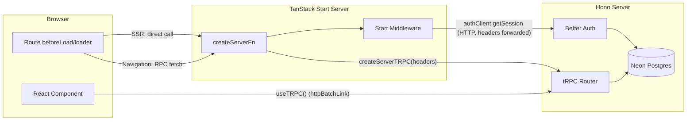

# AGENTS.md

This file provides guidance to agents (Claude Code, Cursor, OpenCode, etc.) when working with code in this repository. `CLAUDE.md` and `.cursor/rules/main.mdc` both point here — treat this as the single source of truth.

## Rules

These rules override default agent behavior. Apply them by default; only deviate if the user explicitly asks for something different.

1. **All server/tRPC schemas and types live in [`apps/server/src/trpc/schemas.ts`](apps/server/src/trpc/schemas.ts).** Router files under `apps/server/src/trpc/routers/` must not declare Zod schemas or inferred input/output types inline; import them from `../schemas` instead. Inside `schemas.ts`, group entries by router (`// admin`, `// feedback`, etc.) and export both the schema and its inferred type (for example `updateProfileSchema` + `UpdateProfileInput`) so the contract is single-source and reusable. Frontend forms and `packages/db` query types are out of scope for this rule and stay where they are.

2. **All DB interactions go through query modules.** In the server app, route handlers and tRPC routers must not issue raw Drizzle queries directly. Put database reads/writes in `packages/db/src/queries/*.ts`, export them via `packages/db/src/queries/index.ts`, and call those functions from routers/server code. Keep auth provider calls (e.g. Better Auth APIs) in the router layer; keep SQL in the DB query layer.

3. **Drizzle: migrations over push.** For schema changes, default to `bun run db:generate` then `bun run db:migrate` so the database stays aligned with committed migration history. Do not suggest or use `bun run db:push` unless the user explicitly asks for it (push bypasses migration files and can drift from `migrate`).

4. **Forms follow the sign-in form template.** The form in [`apps/dashboard/src/routes/_auth/sign-in.tsx`](apps/dashboard/src/routes/_auth/sign-in.tsx) (lines 28–255) is the canonical shape for every form in the dashboard. Auth forms live inline in their route files alongside the schema; only extract a form into `components/` when it's reused or embedded inside a larger, non-form page. New forms mirror the sign-in pattern unless there's a concrete reason not to:
   - **Zod schema + inferred type at the top of the file**: `const xSchema = z.object({ ... })` followed by `type XInput = z.infer<typeof xSchema>`. Keep it co-located with the form; don't hoist it to a shared module until a second caller exists.
   - **`useForm` with `zodResolver(xSchema)` and explicit `defaultValues`** for every field (no implicit `undefined`).
   - **shadcn `Form` composition for every field**: `FormField` → `FormItem` → `Field` → `FieldLabel` + `FormControl` (wrapping the input) + `FieldError reserveSpace` fed by `fieldState.error?.message`. Use `InputGroup` for affordances like password toggles; don't hand-roll absolute-positioned buttons over inputs.
   - **Submit handler is `async (data: XInput) => { ... }` passed through `form.handleSubmit(onSubmit)`.** Inside: `try { const { error } = await clientCall(...); if (error) { toast.error(error.message); return; } /* success path: invalidate cache + navigate */ } catch { toast.error("Couldn't reach server. Check your connection and try again.") }`. Two distinct failure channels — server-returned `error` vs thrown network error — with different copy.
   - **Loading state comes from `form.formState.isSubmitting`**, wired into the submit button's `loading` prop. Do not add a parallel `useState` for pending state. Do not wrap the call in `useMutation` just to get `isPending` — only reach for `useMutation` when you need cache invalidation co-location, global `MutationCache.onError`, or multiple subscribers observing the same write.
   - **Accessibility defaults carried over**: `autoComplete` on every credential/identity input, `aria-label` on icon-only buttons, `htmlFor` pairing on checkboxes via `FieldLabel`.

5. **Prefer route `loader` / `beforeLoad` over in-component queries for initial data.**

6. **Server-backed admin list pages follow the TanStack Table route pattern.** For dashboard admin directories and other URL-driven list pages, co-locate a route search schema with the page module (prefer `*-schema.ts` for search Zod schemas, inferred input types, and small UI constants like labels/maps used only by that feature). Use `validateSearch`, `loaderDeps: ({ search }) => search`, and preload the matching tRPC query with `context.queryClient.ensureQueryData(...)`. In the page, read data with `useSuspenseQuery(...queryOptions(search))` (paired with the loader prefetch). Derive one memoized `tableState` object (`sorting`, `pagination`, `columnFilters`) from URL search and pass it to `useReactTable` with `manualSorting`, `manualPagination`, and `manualFiltering`. Keep all URL updates inside `useReactTable` handlers (`onSortingChange`, `onPaginationChange`, `onColumnFiltersChange`). Wire filter UI components to the table API (`table.getColumn(id)?.getFilterValue()` / `setFilterValue`) instead of separate route-level filter callbacks. For dialogs opened from list toolbars, keep open state inside the dialog component with a local `DialogTrigger` (or equivalent); only hoist dialog `open`/`onOpenChange` when a parent **dropdown menu** must control the dialog without closing the menu first. Avoid parallel `*-helpers.ts` files for a single feature when those exports fit cleanly in the co-located `*-schema` module.

7. **Never fetch derivable data.**

8. **Images go through `@sycom/ui/image`.** Store CDN public IDs (e.g. `"brand/sycom-logo"`) — never full Cloudinary URLs — so swapping providers stays a one-file edit. Static/brand/marketing assets get a constant in [`packages/ui/src/image/assets.ts`](packages/ui/src/image/assets.ts); user-generated assets (avatars, course content) get a `public_id` column in the DB. Render with `<Image src={BRAND.LOGO} ... />` from `@sycom/ui/image` in apps; in emails, use `buildImageUrl()` from `@sycom/ui/image/cdn` with react-email's `` (modern srcset isn't reliable in mail clients). The only place that knows we use Cloudinary is [`packages/ui/src/image/cdn.ts`](packages/ui/src/image/cdn.ts).

## Commands

```bash
bun install              # Install dependencies
bun run dev              # Start all apps (dashboard + website + server) in dev mode
bun run dev:dashboard    # Start only the dashboard app
bun run dev:website      # Start only the website app
bun run dev:server       # Start only the server
bun run build            # Build all apps
bun run check-types      # TypeScript type checking across all packages
bun run check            # Run oxlint + oxfmt (formatting with --write)

# Database (Drizzle + Neon Postgres) — prefer generate + migrate (see rule 3)
bun run db:generate      # Generate migration files
bun run db:migrate       # Run migrations
bun run db:push          # Push schema directly (avoid unless explicitly requested)
bun run db:studio        # Open Drizzle Studio

# Turborepo filtering (run tasks in specific packages)
turbo -F dashboard <task>
turbo -F website <task>
turbo -F server <task>
turbo -F @sycom/db <task>
```

## Architecture

Turborepo monorepo using Bun as runtime and package manager.

The **TanStack Start** dev server (dashboard) handles SSR and `createServerFn`; the **Hono** app (`apps/server`) hosts Better Auth's HTTP routes and tRPC. Both runtimes import `@sycom/auth` directly and resolve sessions in-process via `auth.api.getSession({ headers })`. The Start runtime talks to Hono over HTTP for tRPC procedures (browser → Hono via `httpBatchLink` with `credentials: "include"`; Start server functions → Hono via `createServerTRPC(headers)`).

### Execution model



### Apps

- **`apps/dashboard`** - Authenticated TanStack Start app. Uses SSR, TanStack Router, and a tRPC client. Session and route guards use `createServerFn` and Start middleware. Product data is fetched via tRPC from the Hono server. Vite dev server on port 3000. Path alias: `@/` → `src/`.
- **`apps/website`** - Public-facing website for SEO and marketing. React + TanStack Router. No auth dependencies. Vite dev server on port 3002. Uses `@` path alias for `src/`.
- **`apps/server`** - Hono HTTP server with hot reload (`bun run --hot`). Runs on port 3001. Mounts Better Auth at `/api/auth/*` and tRPC at `/trpc/*`. Acts as the single source of truth for backend logic and database access.

### Packages

- **`@sycom/db`** - Drizzle ORM setup with Neon serverless driver. Contains schema definitions and database query modules.
- **`@sycom/auth`** - Better Auth configuration. Imported only by the Hono server for HTTP auth routes and tRPC context.
- **`@sycom/env`** - Type-safe environment variable validation via `@t3-oss/env-core`.
- **`@sycom/ui`** - Shared shadcn/ui components (`base-lyra` style).
- **`@sycom/config`** - Shared base TypeScript configurations.

### Key data flow

The **Hono server** (`apps/server`) owns Better Auth and the database. `createContext()` in [`apps/server/src/trpc/context.ts`](apps/server/src/trpc/context.ts) resolves the session from request headers via `auth.api.getSession` and exposes `db` to procedures.

The **dashboard** talks to that server over HTTP for both session and tRPC:

- **Client tRPC**: Browser components use `useTRPC()` from `@/lib/trpc/client` (`httpBatchLink` to `VITE_SERVER_URL/trpc` with `credentials: "include"`).
- **Server tRPC**: Server functions use the `serverTRPC` client from `@/lib/trpc/server`. It uses `getForwardedCookieHeader()` to automatically forward the incoming `cookie` header to Hono, ensuring protected procedures see the user's session.
- **Session**: TanStack Start server functions forward the incoming `request.headers` to Hono via `authClient.getSession` in `apps/dashboard/src/middleware/auth.ts`. The canonical session server function is `getSession` in `apps/dashboard/src/functions/get-session.ts`. Protected tRPC procedures still enforce auth on the server regardless of any client-side checks.

### shadcn/ui setup

Three `components.json` files exist:

- `packages/ui/components.json` - for shared primitives (add with `-c packages/ui`)
- `apps/dashboard/components.json` - for dashboard-specific components (run from `apps/dashboard`)
- `apps/website/components.json` - for website-specific components (run from `apps/website`)

All use `base-lyra` style and lucide icons.

## Linting & Formatting

Oxlint (with typescript, unicorn, oxc, react, jsx-a11y plugins) and Oxfmt. Pre-commit hook via Lefthook auto-fixes staged files. No ESLint/Prettier/Biome.

## Environment

Server environment variables live in `apps/server/.env` (e.g., `DATABASE_URL`, `BETTER_AUTH_SECRET`, `BETTER_AUTH_URL`, `CORS_ORIGIN`). The dashboard's Start server does not hold these—it reaches Better Auth over HTTP. Web environment variables use the `VITE_` prefix. All variables are strictly validated through the `@sycom/env` package.
