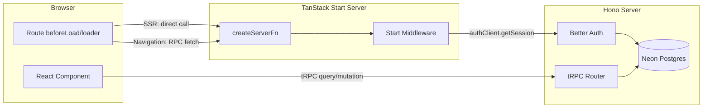

# AGENTS.md

This file provides guidance to agents (Claude Code, Cursor, OpenCode, etc.) when working with code in this repository. `CLAUDE.md` and `.cursor/rules/main.mdc` both point here — treat this as the single source of truth.

## Rules

These rules override default agent behavior. Apply them by default; only deviate if the user explicitly asks for something different.

1. **Never fetch derivable data.** If auth state or any other value is resolvable via router context, a parent route's `beforeLoad`/`loader`, or existing query cache, read it from there — do not issue a second network call. In the dashboard app, the session is fetched once in the root route and exposed via `Route.useRouteContext()`; components must never call `authClient.useSession()`.

2. **Invalidate, don't re-navigate, on state change.** After auth mutations (`signIn`, `signUp`, `signOut`) or any write that alters session/permissions, invalidate both the session query (`queryClient.invalidateQueries({ queryKey: ["session"] })`) and the router (`router.invalidate()`). `beforeLoad` re-runs, re-reads the session through React Query, and handles redirects — avoid manually chaining `navigate()` calls that duplicate routing logic.

3. **Prefer route `loader` / `beforeLoad` over in-component queries for initial data.** Components should render data that's already been fetched by the route. Reserve `useQuery` for interactive refetches, mutations' optimistic invalidation, or data that genuinely loads after mount.

4. **Cache aggressively through React Query.** The QueryClient default is `staleTime: 60_000`. Route loaders and `beforeLoad` should fetch through `queryClient.ensureQueryData({ queryKey, queryFn })` so preloads and navigations hit the cache instead of the network. In this setup, `defaultPreloadStaleTime: 0` is correct — TanStack Router always invokes the loader, but React Query's `staleTime` (not the router's) decides whether a fetch actually happens. The session is already wired this way in `__root.tsx` with `queryKey: ["session"]`; follow the same pattern for other route data. Invalidate on writes; never refetch on every navigation.

5. **Lazy-load heavy or non-critical dependencies.** Animation libraries, markdown renderers, chart libraries, and below-the-fold components should be `React.lazy`'d so they stay out of the initial bundle. For `motion`, prefer `m` + `<LazyMotion features={domAnimation}>` over the default `motion` component.

6. **No dead pages.** The dashboard app is fully auth-gated — public marketing/SEO content lives in `apps/website`. If a route has no purpose, delete it or convert it to a redirect. Don't leave health-check placeholders in production routes.

7. **Route `loader` / `beforeLoad` are isomorphic (TanStack Start).** They run on the server during SSR and on the client during navigations. Never put secrets, server-only `process.env`, direct database access, or server-only imports in route modules — all server-only work MUST go through `createServerFn` handlers called from loaders/`beforeLoad`. Avoid hydration mismatches for browser-only values (use a stable SSR fallback, `useEffect`, `ClientOnly`, or `useHydrated`).

8. **tRPC for app data; Start server functions for session on the dashboard.** Domain APIs and persistence go through the Hono tRPC router. Session resolution for routing and layout guards uses `createServerFn` plus Start middleware (see `apps/dashboard/src/functions/`, `apps/dashboard/src/middleware/`). Do not duplicate the same server work in both places.

9. **Dashboard auth middleware uses the Better Auth HTTP client by design.** The TanStack Start server resolves the user by forwarding the incoming request's cookies/headers to the Hono app (`authClient.getSession` with `fetchOptions.headers`). The Start process does not host Better Auth or open `DATABASE_URL` for session reads — do not "optimize" this by importing `@sycom/auth` and calling `auth.api.getSession` from Start middleware unless the architecture is changed to colocate auth on the Start server.

10. **Compose middleware; do not inline cross-cutting logic.** Wrap shared concerns (auth, logging, authorization) in `createMiddleware()` from `@tanstack/react-start`, attach chains with `.middleware([...])`, and pass data with `next({ context })`. For role or permission checks, prefer middleware factories that take parameters and compose on top of `authMiddleware` (for example `authorizationMiddleware({ course: ["read"] })`). Do not add global request or global server-function middleware (`src/start.ts` / `createStart`) unless the team explicitly requests it.

11. **File conventions for Start boundaries.** `createServerFn` exports live under `apps/dashboard/src/functions/`. Shared Start middleware lives under `apps/dashboard/src/middleware/`. Server-only helpers that must never ship to the client should live in `*.server.ts` files and only be imported from server function handlers (or other server-only modules).

12. **Prefer query invalidation over one-off `refetch()`.** After tRPC mutations (or other writes), call `queryClient.invalidateQueries({ queryKey: [...] })` or use the tRPC mutation `onSuccess` invalidation pattern so every subscriber updates together — avoid relying on `query.refetch()` only in the component that fired the mutation.

## Commands

```bash
bun install              # Install dependencies
bun run dev              # Start all apps (dashboard + website + server) in dev mode
bun run dev:dashboard    # Start only the dashboard app
bun run dev:website      # Start only the website app
bun run dev:server       # Start only the server
bun run build            # Build all apps
bun run check-types      # TypeScript type checking across all packages
bun run check            # Run oxlint + oxfmt (formatting with --write)

# Database (Drizzle + Neon Postgres)
bun run db:push          # Push schema changes to database
bun run db:generate      # Generate migration files
bun run db:migrate       # Run migrations
bun run db:studio        # Open Drizzle Studio

# Turborepo filtering (run tasks in specific packages)
turbo -F dashboard <task>
turbo -F website <task>
turbo -F server <task>
turbo -F @sycom/db <task>
```

## Architecture

Turborepo monorepo using Bun as runtime and package manager.

The **TanStack Start** dev server (dashboard) handles SSR and `createServerFn`; the **Hono** app (`apps/server`) hosts Better Auth and tRPC. The Start runtime talks to Hono over HTTP (session via `authClient`, data via tRPC).

### Execution model



### Apps

- **`apps/dashboard`** - Authenticated TanStack Start app (SSR + TanStack Router + tRPC client). Session and route guards use `createServerFn` / Start middleware; product data uses tRPC against the Hono server. Vite dev server on port 3000. Path alias: `@/` → `src/`.
- **`apps/website`** - Public-facing website for SEO/marketing pages. React + TanStack Router, no auth dependencies. Vite dev server on port 3002. Uses `@` path alias for `src/`.
- **`apps/server`** - Hono HTTP server with hot reload (`bun run --hot`). Runs on port 3001. Mounts Better Auth at `/api/auth/*` and tRPC at `/trpc/*`. tRPC panel available at `/docs` in non-production environments. Entry point: `src/index.ts`. tRPC routers and middleware live under `src/trpc/` (`routers/_app.ts` merges sub-routers). `src/utils/` for server-only helpers.

### Packages

- **`@sycom/db`** - Drizzle ORM setup with Neon serverless driver. Schema files in `src/schema/`. Drizzle config reads `.env` from `apps/server/.env`.
- **`@sycom/auth`** - Better Auth configuration with Drizzle adapter and email/password auth (used by the Hono server, not imported for session resolution inside TanStack Start middleware).
- **`@sycom/env`** - Type-safe env validation via `@t3-oss/env-core`. Exports `env` from `./server` (DATABASE_URL, BETTER_AUTH_SECRET, BETTER_AUTH_URL, CORS_ORIGIN, NODE_ENV) and `./web` (`VITE_SERVER_URL`, `VITE_WEBSITE_URL`, `VITE_DASHBOARD_URL`).
- **`@sycom/ui`** - Shared shadcn/ui components (style: `base-lyra`). Import as `@sycom/ui/components/<name>`. Global styles in `src/styles/globals.css`.
- **`@sycom/config`** - Shared base tsconfig.

### Key data flow

The **Hono server** (`apps/server`) owns Better Auth and the database. `createContext()` in [`apps/server/src/trpc/context.ts`](apps/server/src/trpc/context.ts) resolves the session from request headers via `auth.api.getSession` and exposes `db` to procedures.

The **dashboard** talks to that server over HTTP: the tRPC client targets `VITE_SERVER_URL/trpc` with `credentials: "include"`. For SSR and navigations, TanStack Start server functions (for example `getUser`) run on the Start server and call Better Auth through `authClient` so cookies reach the same Hono instance. Protected tRPC procedures still enforce auth on the server regardless of any client-side checks.

### shadcn/ui setup

Three `components.json` files exist:

- `packages/ui/components.json` - for shared primitives (add with `-c packages/ui`)
- `apps/dashboard/components.json` - for dashboard-specific components (run from `apps/dashboard`)
- `apps/website/components.json` - for website-specific components (run from `apps/website`)

All use `base-lyra` style and lucide icons.

## Linting & Formatting

Oxlint (with typescript, unicorn, oxc, react, jsx-a11y plugins) and Oxfmt. Pre-commit hook via Lefthook auto-fixes staged files. No ESLint/Prettier/Biome.

## Environment

Server env lives in `apps/server/.env`. Required variables: `DATABASE_URL`, `BETTER_AUTH_SECRET` (min 32 chars), `BETTER_AUTH_URL`, `CORS_ORIGIN`. Web env uses `VITE_` prefixed variables.
