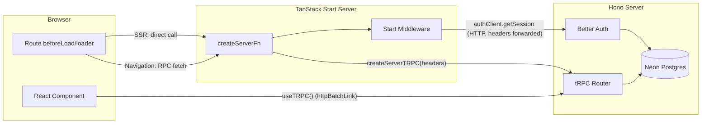

# AGENTS.md

This file provides guidance to agents (Claude Code, Cursor, OpenCode, etc.) when working with code in this repository. `CLAUDE.md` and `.cursor/rules/main.mdc` both point here — treat this as the single source of truth.

## Rules

These rules override default agent behavior. Apply them by default; only deviate if the user explicitly asks for something different.

1. **Never fetch derivable data.** If auth state or any other value is resolvable via router context, a parent route's `beforeLoad`/`loader`, or existing query cache, read it from there — do not issue a second network call. In the dashboard app, the session is fetched lazily inside the `_auth` and `_authenticated` layouts (both call `ensureQueryData(sessionQueryOptions())` — see [`apps/dashboard/src/lib/auth/session.ts`](apps/dashboard/src/lib/auth/session.ts)); within `_authenticated`'s subtree use [`useAuthenticatedContext`](apps/dashboard/src/lib/auth/authenticated-context.ts) / [`useUser`](apps/dashboard/src/lib/auth/authenticated-context.ts) (backed by `trpc.me.get` + route context) instead of ad-hoc `getRouteApi` calls. Do not call `authClient.useSession()` for layout/session state and do not refetch the session query on every navigation.

2. **Prefer route `loader` / `beforeLoad` over in-component queries for initial data.** Components should render data that's already been fetched by the route. Reserve `useQuery` for interactive refetches, mutations' optimistic invalidation, or data that genuinely loads after mount.

3. **Cache aggressively through React Query.** The QueryClient default is `staleTime: 2 * 60 * 1000` (2 min) with `refetchOnWindowFocus: false`. Session uses a 5 min override via `sessionQueryOptions()` in [`apps/dashboard/src/lib/auth/session.ts`](apps/dashboard/src/lib/auth/session.ts). Route loaders and `beforeLoad` must fetch through `queryClient.ensureQueryData(...)` so preloads and navigations hit the cache instead of the network. With `defaultPreloadStaleTime: 0`, TanStack Router always invokes the loader, but React Query's `staleTime` decides whether a fetch actually happens. **Session cache writes:** after sign-in, the standard is `removeQueries(SESSION_QUERY_KEY)` then `prefetchQuery(sessionQueryOptions())` before navigating so the next guarded `beforeLoad` hits a warm cache; on sign-out use `setQueryData(SESSION_QUERY_KEY, null)`; otherwise prefer `invalidateQueries` when session might have changed. Per-query staleTime overrides are allowed but should be co-located in a query options factory, never sprinkled at call sites.

4. **Lazy-load heavy or non-critical dependencies.** Animation libraries, markdown renderers, chart libraries, and below-the-fold components should be `React.lazy`'d so they stay out of the initial bundle. For `motion`, prefer `m` + `<LazyMotion features={domAnimation}>` over the default `motion` component.

5. **No dead pages.** The dashboard app is fully auth-gated — public marketing/SEO content lives in `apps/website`. If a route has no purpose, delete it or convert it to a redirect. Don't leave health-check placeholders in production routes.

6. **Route `loader` / `beforeLoad` are isomorphic (TanStack Start).** They run on the server during SSR and on the client during navigations. Never put secrets, server-only `process.env`, direct database access, or server-only imports in route modules — all server-only work MUST go through `createServerFn` handlers called from loaders/`beforeLoad`. Avoid hydration mismatches for browser-only values (use a stable SSR fallback, `useEffect`, `ClientOnly`, or `useHydrated`).

7. **tRPC for app data; Start server functions for session on the dashboard.** Domain APIs and persistence go through the Hono tRPC router. Session resolution for routing and layout guards uses `createServerFn` plus Start middleware (see `apps/dashboard/src/functions/`, `apps/dashboard/src/middleware/`). Hono resolves sessions in-process via `auth.api.getSession({ headers })` in `apps/server/src/trpc/context.ts`; Start resolves sessions by forwarding the incoming `request.headers` to Hono via `authClient.getSession` (same source of truth, no duplicate DB access in the Start process). Do not duplicate the same server work in both places.

8. **Dashboard Start middleware uses the Better Auth HTTP client by design.** The TanStack Start server resolves sessions by calling `authClient.getSession({ fetchOptions: { headers: request.headers, throw: true } })` in `apps/dashboard/src/middleware/auth.ts` (`sessionMiddleware` resolves; `requireSessionMiddleware` enforces). The Start process does NOT import `@sycom/auth`'s `auth` instance and does NOT hold `DATABASE_URL` or `BETTER_AUTH_SECRET` — only Hono does. Do not "optimize" this by importing `@sycom/auth` in Start middleware unless the architecture is changed to colocate auth on the Start server. `@sycom/auth/permissions` (pure access-control constants) is safe to import anywhere.

9. **Compose middleware; do not inline cross-cutting logic.** Wrap shared concerns (auth, logging, authorization) in `createMiddleware()` from `@tanstack/react-start`, attach chains with `.middleware([...])`, and pass data with `next({ context })`. For role or permission checks, prefer middleware factories that take parameters and compose on top of `authMiddleware` (for example `authorizationMiddleware({ course: ["read"] })`). Do not add global request or global server-function middleware (`src/start.ts` / `createStart`) unless the team explicitly requests it.

10. **File conventions for Start boundaries.** `createServerFn` exports live under `apps/dashboard/src/functions/`. Shared Start middleware lives under `apps/dashboard/src/middleware/`. Server-only helpers that must never ship to the client should live in `*.server.ts` files and only be imported from server function handlers (or other server-only modules).

11. **Prefer query invalidation over one-off `refetch()`.** After tRPC mutations (or other writes), call `queryClient.invalidateQueries({ queryKey: [...] })` or use the tRPC mutation `onSuccess` invalidation pattern so every subscriber updates together — avoid relying on `query.refetch()` only in the component that fired the mutation.

12. **Forms follow the sign-in form template.** The form in [`apps/dashboard/src/routes/_auth/sign-in.tsx`](apps/dashboard/src/routes/_auth/sign-in.tsx) (lines 28–255) is the canonical shape for every form in the dashboard. Auth forms live inline in their route files alongside the schema; only extract a form into `components/` when it's reused or embedded inside a larger, non-form page. New forms mirror the sign-in pattern unless there's a concrete reason not to:
    - **Zod schema + inferred type at the top of the file**: `const xSchema = z.object({ ... })` followed by `type XInput = z.infer<typeof xSchema>`. Keep it co-located with the form; don't hoist it to a shared module until a second caller exists.
    - **`useForm` with `zodResolver(xSchema)` and explicit `defaultValues`** for every field (no implicit `undefined`).
    - **shadcn `Form` composition for every field**: `FormField` → `FormItem` → `Field` → `FieldLabel` + `FormControl` (wrapping the input) + `FieldError reserveSpace` fed by `fieldState.error?.message`. Use `InputGroup` for affordances like password toggles; don't hand-roll absolute-positioned buttons over inputs.
    - **Submit handler is `async (data: XInput) => { ... }` passed through `form.handleSubmit(onSubmit)`.** Inside: `try { const { error } = await clientCall(...); if (error) { toast.error(error.message); return; } /* success path: invalidate cache + navigate */ } catch { toast.error("Couldn't reach server. Check your connection and try again.") }`. Two distinct failure channels — server-returned `error` vs thrown network error — with different copy.
    - **Loading state comes from `form.formState.isSubmitting`**, wired into the submit button's `loading` prop. Do not add a parallel `useState` for pending state. Do not wrap the call in `useMutation` just to get `isPending` — only reach for `useMutation` when you need cache invalidation co-location, global `MutationCache.onError`, or multiple subscribers observing the same write.
    - **Accessibility defaults carried over**: `autoComplete` on every credential/identity input, `aria-label` on icon-only buttons, `htmlFor` pairing on checkboxes via `FieldLabel`.

13. **Drizzle: migrations over push.** For schema changes, default to `bun run db:generate` then `bun run db:migrate` so the database stays aligned with committed migration history. Do not suggest or use `bun run db:push` unless the user explicitly asks for it (push bypasses migration files and can drift from `migrate`).

14. **Two tRPC clients in the dashboard, one source of procedures.** Browser components use `useTRPC()` / `useTRPCClient()` from `@/lib/trpc/client` (the `createTRPCContext` instance wired through `TRPCProvider`). Server functions that need to call procedures use `createServerTRPC(headers)` from `@/lib/trpc/server` — instantiate it inside the handler, pass the incoming `request.headers`, and the helper forwards the `cookie` header so protected procedures see the session. Never instantiate `createTRPCClient` ad-hoc inside a server function; never import `appRouter` for in-process calls (Hono stays the single execution path for procedures).

15. **Loader pattern — critical vs deferred.** In a route's `loader`, `await queryClient.ensureQueryData(...)` for data the page can't render without (renders inside `pendingComponent`) and consume it via `useSuspenseQuery` in the component. For data that should stream in after first paint, return the unawaited promise from the loader and consume via `<Suspense fallback={...}><Await promise={p}>{(data) => ...}</Await></Suspense>`. Examples: [`apps/dashboard/src/routes/_authenticated/dashboard.tsx`](apps/dashboard/src/routes/_authenticated/dashboard.tsx), [`apps/dashboard/src/routes/_authenticated/settings.profile.tsx`](apps/dashboard/src/routes/_authenticated/settings.profile.tsx), [`apps/dashboard/src/routes/_authenticated/help.tsx`](apps/dashboard/src/routes/_authenticated/help.tsx). See [`apps/dashboard/DATA-LOADING.md`](apps/dashboard/DATA-LOADING.md) for the full playbook.

## Commands

```bash
bun install              # Install dependencies
bun run dev              # Start all apps (dashboard + website + server) in dev mode
bun run dev:dashboard    # Start only the dashboard app
bun run dev:website      # Start only the website app
bun run dev:server       # Start only the server
bun run build            # Build all apps
bun run check-types      # TypeScript type checking across all packages
bun run check            # Run oxlint + oxfmt (formatting with --write)

# Database (Drizzle + Neon Postgres) — prefer generate + migrate (see rule 13)
bun run db:generate      # Generate migration files
bun run db:migrate       # Run migrations
bun run db:push          # Push schema directly (avoid unless explicitly requested)
bun run db:studio        # Open Drizzle Studio

# Turborepo filtering (run tasks in specific packages)
turbo -F dashboard <task>
turbo -F website <task>
turbo -F server <task>
turbo -F @sycom/db <task>
```

## Architecture

Turborepo monorepo using Bun as runtime and package manager.

The **TanStack Start** dev server (dashboard) handles SSR and `createServerFn`; the **Hono** app (`apps/server`) hosts Better Auth's HTTP routes and tRPC. Both runtimes import `@sycom/auth` directly and resolve sessions in-process via `auth.api.getSession({ headers })`. The Start runtime talks to Hono over HTTP for tRPC procedures (browser → Hono via `httpBatchLink` with `credentials: "include"`; Start server functions → Hono via `createServerTRPC(headers)`).

### Execution model



### Apps

- **`apps/dashboard`** - Authenticated TanStack Start app (SSR + TanStack Router + tRPC client). Session and route guards use `createServerFn` / Start middleware; product data uses tRPC against the Hono server. Vite dev server on port 3000. Path alias: `@/` → `src/`.
- **`apps/website`** - Public-facing website for SEO/marketing pages. React + TanStack Router, no auth dependencies. Vite dev server on port 3002. Uses `@` path alias for `src/`.
- **`apps/server`** - Hono HTTP server with hot reload (`bun run --hot`). Runs on port 3001. Mounts Better Auth at `/api/auth/*` and tRPC at `/trpc/*`. tRPC panel available at `/docs` in non-production environments. Entry point: `src/index.ts`. tRPC routers and middleware live under `src/trpc/` (`routers/_app.ts` merges sub-routers). `src/utils/` for server-only helpers.

### Packages

- **`@sycom/db`** - Drizzle ORM setup with Neon serverless driver. Schema files in `src/schema/`. Drizzle config reads `.env` from `apps/server/.env`.
- **`@sycom/auth`** - Better Auth configuration with Drizzle adapter and email/password auth. The `auth` instance is imported only by the Hono server (HTTP auth routes + tRPC context). The dashboard imports `@sycom/auth/permissions` (pure access-control constants) for its `authClient` plugin config — not the `auth` instance itself.
- **`@sycom/env`** - Type-safe env validation via `@t3-oss/env-core`. Exports `env` from `./server` (DATABASE_URL, BETTER_AUTH_SECRET, BETTER_AUTH_URL, CORS_ORIGIN, NODE_ENV) and `./web` (`VITE_SERVER_URL`, `VITE_WEBSITE_URL`, `VITE_DASHBOARD_URL`).
- **`@sycom/ui`** - Shared shadcn/ui components (style: `base-lyra`). Import as `@sycom/ui/components/<name>`. Global styles in `src/styles/globals.css`.
- **`@sycom/config`** - Shared base tsconfig.

### Key data flow

The **Hono server** (`apps/server`) owns Better Auth and the database. `createContext()` in [`apps/server/src/trpc/context.ts`](apps/server/src/trpc/context.ts) resolves the session from request headers via `auth.api.getSession` and exposes `db` to procedures.

The **dashboard** talks to that server over HTTP for both session and tRPC. For tRPC, the browser uses `useTRPC()` from `@/lib/trpc/client` (httpBatchLink to `VITE_SERVER_URL/trpc` with `credentials: "include"`); server functions use `createServerTRPC(headers)` from `@/lib/trpc/server` (per-request httpBatchLink that forwards the incoming `cookie` header). For session, TanStack Start server functions forward the incoming `request.headers` to Hono via `authClient.getSession` in `apps/dashboard/src/middleware/auth.ts` (`sessionMiddleware` / `requireSessionMiddleware`); the canonical session server function is `getSession` in `apps/dashboard/src/functions/get-session.ts`. The session query is centralised behind `sessionQueryOptions()` in `apps/dashboard/src/lib/auth/session.ts` (5 min staleTime). Protected tRPC procedures still enforce auth on the server regardless of any client-side checks.

### shadcn/ui setup

Three `components.json` files exist:

- `packages/ui/components.json` - for shared primitives (add with `-c packages/ui`)
- `apps/dashboard/components.json` - for dashboard-specific components (run from `apps/dashboard`)
- `apps/website/components.json` - for website-specific components (run from `apps/website`)

All use `base-lyra` style and lucide icons.

## Linting & Formatting

Oxlint (with typescript, unicorn, oxc, react, jsx-a11y plugins) and Oxfmt. Pre-commit hook via Lefthook auto-fixes staged files. No ESLint/Prettier/Biome.

## Environment

Server env lives in `apps/server/.env`. Required variables: `DATABASE_URL`, `BETTER_AUTH_SECRET` (min 32 chars), `BETTER_AUTH_URL`, `CORS_ORIGIN`. The dashboard's Start server does not hold these — it reaches Better Auth over HTTP. Web env (both apps) uses `VITE_` prefixed variables.
